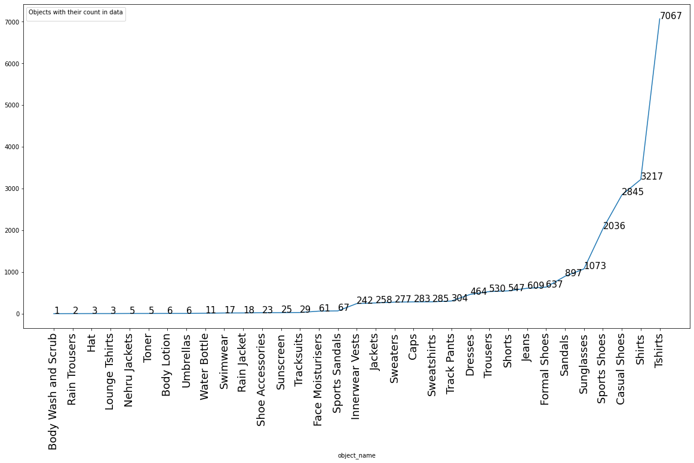

The categories in the fashion dataset is something like and the ones in bold are selected to go for detection.Further this datasetcan be downloaded from the [link](https://www.kaggle.com/paramaggarwal/fashion-product-images-small) : -              

{'Accessories': ['Accessory Gift Set', 'Backpacks', 'Bangle', 'Belts', 'Bracelet', **'Caps'**, 'Clutches', 'Cufflinks', 'Duffel Bag', 'Earrings', 'Gloves', 'Hair Accessory', 'Handbags', **'Hat'**, 'Headband', 'Jewellery Set', 'Key chain', 'Laptop Bag', 'Messenger Bag', 'Mobile Pouch', 'Mufflers',
'Necklace and Chains', 'Pendant', 'Perfume and Body Mist', 'Ring', 'Rucksacks', 'Scarves', **'Shoe Accessories'**, 'Shoe Laces', 'Socks', 'Stoles', **'Sunglasses'**, 'Tablet Sleeve', 'Ties', 'Ties and Cufflinks', 'Travel Accessory', 'Trolley Bag', **'Tshirts'**, **'Umbrellas'**, 'Waist Pouch', 'Wallets',
'Watches', **'Water Bottle'**, 'Wristbands'],               

'Apparel': ['Baby Dolls', 'Bath Robe', 'Belts', 'Blazers', 'Booties', 'Boxers', 'Bra', 'Briefs', 'Camisoles', 'Capris', 'Churidar', 'Clothing Set', **'Dresses'**, 'Dupatta', **'Innerwear Vests'**, **'Jackets'**, **'Jeans'**, 'Jeggings', 'Jumpsuit', 'Kurta Sets', 'Kurtas', 'Kurtis', 'Leggings', 'Lehenga Choli', 'Lounge Pants', 'Lounge Shorts', **'Lounge Tshirts'**, **'Nehru Jackets'**, 'Night suits', 'Nightdress',
'Patiala', **'Rain Jacket'**, **'Rain Trousers'**, 'Robe', 'Rompers', 'Salwar', 'Salwar and Dupatta', 'Sarees', 'Shapewear', **'Shirts'**, **'Shorts'**, 'Shrug', 'Skirts', 'Stockings', 'Suits', 'Suspenders', **'Sweaters'**, **'Sweatshirts'**, **'Swimwear'**, 'Tights', 'Tops', **'Track Pants'**, **'Tracksuits'**, **'Trousers'**,
'Trunk', **'Tshirts'**, 'Tunics', 'Waistcoat'],                 

'Footwear': [**'Casual Shoes'**, 'Flats', 'Flip Flops', **'Formal Shoes'**, 'Heels', **'Sandals'**, **'Sports Sandals', 'Sports Shoes'**],                      

'Free Items': ['Backpacks', 'Clutches', 'Free Gifts', 'Handbags', 'Ipad', 'Laptop Bag', 'Scarves', 'Ties', 'Wallets'],          

'Home': ['Cushion Covers'], 

'Personal Care': ['Beauty Accessory', **'Body Lotion', 'Body Wash and Scrub',** 'Compact', 'Concealer', 'Deodorant', 'Eye Cream', 'Eyeshadow', **'Face Moisturisers'**, 'Face Scrub and Exfoliator', 'Face Serum and Gel', 'Face Wash and Cleanser', 'Foundation and Primer', 'Fragrance Gift Set', 'Hair Colour', 'Highlighter and Blush', 'Kajal and Eyeliner', 'Lip Care', 'Lip Gloss', 'Lip Liner', 'Lip Plumper', 'Lipstick',
'Makeup Remover', 'Mascara', 'Mask and Peel', 'Mens Grooming Kit', 'Nail Essentials', 'Nail Polish', 'Perfume and Body Mist', **'Sunscreen', 'Toner'**],                

'Sporting Goods': ['Basketballs', 'Footballs', 'Wristbands']}               

The above categories count are as follows: -                    

Therefore we will only take the objects having classes more than 200 i.e.               
('Innerwear Vests', 242), ('Jackets', 258), ('Sweaters', 277), ('Caps', 283), ('Sweatshirts', 285), ('Track Pants', 304), ('Dresses', 464), ('Trousers', 530), ('Shorts', 547), ('Jeans', 609), ('Formal Shoes', 637), ('Sandals', 897), ('Sunglasses', 1073), ('Sports Shoes', 2036), ('Casual Shoes', 2845), ('Shirts', 3217), ('Tshirts', 7067)

The data will be augmented if category has no. of images less than 700 and if it is more than 1200 other images present in category are removed. 

The augmentation will be of different no. of types for different number of categories depending how many images it contains i.e.                
| Number of images | No. of augmented techniques |
|------------------|-----------------:|
|200-300           | 5 types |
|300-400|4 types|
|400-500|3 types|
|500-600|2 types|
|600-700|1 type|

The augmented techniques will be: -         
| Technique no. | Technique |
|------------------|-----------------:|
|5th|shearing the image to 40&deg;  |
|4th|cropping the image by 30% from one side|
|3rd|converting the image to black and white|
|2nd|rotating the image 180&deg;|
|1st|rotating the image 45&deg;|

The library used for data augmentation is [imgaug](https://towardsdatascience.com/data-augmentation-techniques-in-python-f216ef5eed69)      
               
After the augmentation the images are stored in different folders according to the operations applied. Then each folder is accessed and each image is read by PIL library and stored in a tuple with it's label as unique number as this was the format used in pytorch training dataset. After that it is convereted into a pickle file and uploaded on the [drive](https://drive.google.com/drive/folders/1XLP1yVzqrMN32xoii_u7DI7RT_VzTYj3?usp=sharing)  